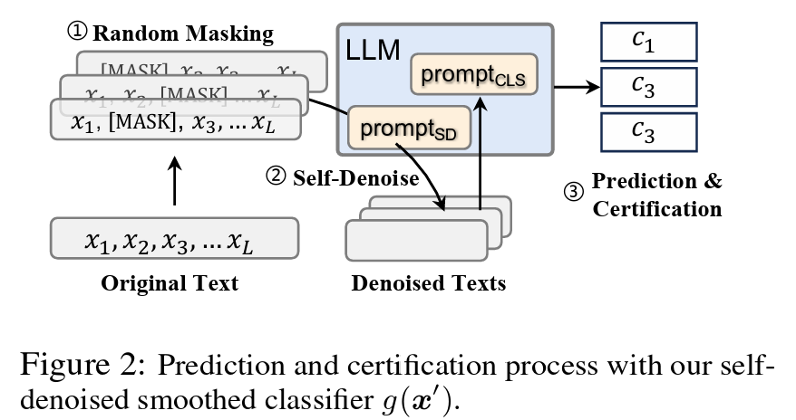
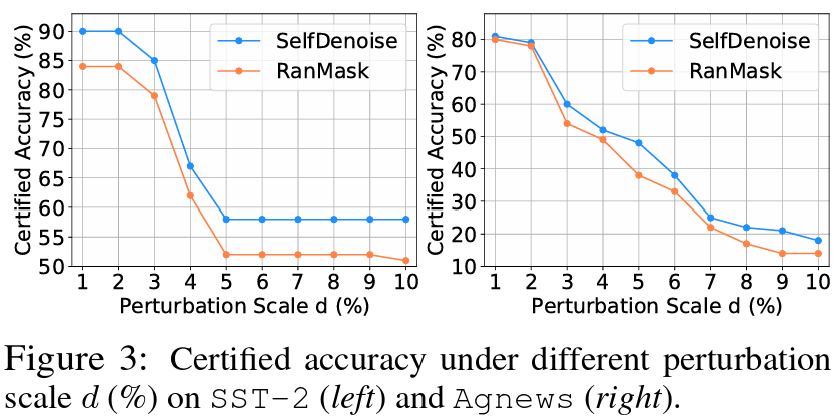
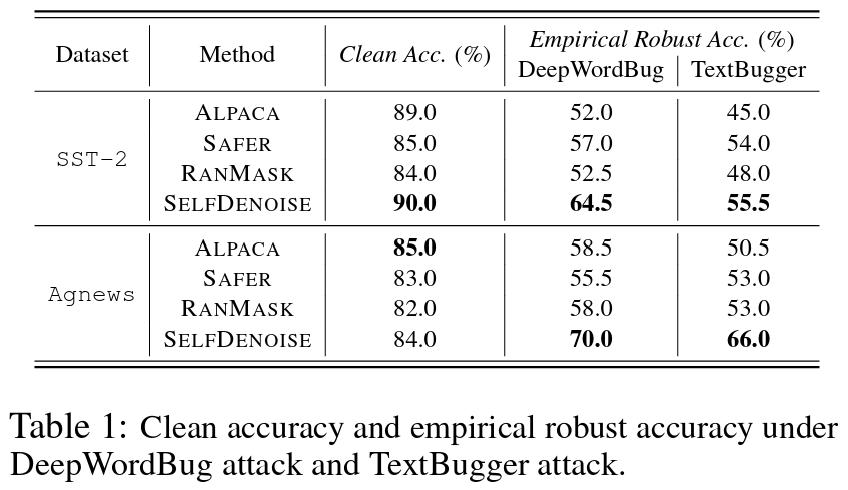

# Advancing the Robustness of Large Language Models through Self-Denoised Smoothing
This is the official implementation of the NAACL paper [*Advancing the Robustness of Large Language Models through Self-Denoised Smoothing*](https://arxiv.org/abs/2404.12274).

## Overview


Although large language models (LLMs) have achieved significant success, their vulnerability to adversarial perturbations, including recent jailbreak attacks, has raised considerable concerns. However, the increasing size of these models and their limited access make improving their robustness a challenging task. Among various defense strategies, randomized smoothing has shown great potential for LLMs, as it does not require full access to the model's parameters or fine-tuning via adversarial training. However, randomized smoothing involves adding noise to the input before model prediction, and the final model's robustness largely depends on the model's performance on these noise-corrupted data. Its effectiveness is often limited by the model's sub-optimal performance on noisy data. To address this issue, we propose to leverage the multitasking nature of LLMs to first denoise the noisy inputs and then to make predictions based on these denoised versions. We call this procedure self-denoised smoothing. Unlike previous denoised smoothing techniques in computer vision, which require training a separate model to enhance the robustness of LLMs, our method offers significantly better efficiency and flexibility. Our experimental results indicate that our method surpasses existing methods in both empirical and certified robustness in defending against adversarial attacks for both downstream tasks and human alignments (i.e., jailbreak attacks). 

## Getting Started 
Configure the new environment:
```sh
pip install -r ./requirement.txt
```
When you encounter an error like this:
```sh
Traceback (most recent call last):
  File "/mnt/data/zhenzhang/dir1/SelfDenoise/code/main.py", line 8, in <module>
    from classifier import Classifier
  File "/mnt/data/zhenzhang/dir1/SelfDenoise/code/classifier.py", line 14, in <module>
    from torchnlp.samplers.bucket_batch_sampler import BucketBatchSampler
  File "/mnt/data/zhenzhang/miniconda3/envs/sd/lib/python3.9/site-packages/torchnlp/samplers/__init__.py", line 1, in <module>
    from torchnlp.samplers.balanced_sampler import BalancedSampler
  File "/mnt/data/zhenzhang/miniconda3/envs/sd/lib/python3.9/site-packages/torchnlp/samplers/balanced_sampler.py", line 1, in <module>
    from torchnlp._third_party.weighted_random_sampler import WeightedRandomSampler
  File "/mnt/data/zhenzhang/miniconda3/envs/sd/lib/python3.9/site-packages/torchnlp/_third_party/weighted_random_sampler.py", line 4, in <module>
    from torch._six import int_classes as _int_classes
ModuleNotFoundError: No module named 'torch._six'
```

modify `torchnlp/_third_party/weighted_random_sampler.py` like this:
```python
import torch

from torch.utils.data.sampler import Sampler
# from torch._six import int_classes as _int_classes
torch._six = (bool, int)
```

Before running the code, you need to download Alpaca first:
```sh
bash ./config_alpaca.sh
```


## Results

### Certified Accuracy


Run scripts located in `./code/script/certified` to reproduce the result.`

### Empirical Robust Accuracy


Run scripts located in `./code/script/empirical` to reproduce the result.


## Reference
Our code is build based on [RanMASK](https://github.com/zjiehang/RanMASK):
```bibtex
@article{zeng2023certified,
  title={Certified robustness to text adversarial attacks by randomized [mask]},
  author={Zeng, Jiehang and Xu, Jianhan and Zheng, Xiaoqing and Huang, Xuanjing},
  journal={Computational Linguistics},
  volume={49},
  number={2},
  pages={395--427},
  year={2023},
  publisher={MIT Press}
}
```

## Citation
If you find this repository useful, please consider to cite our work:
```bibtex
@article{ji2024advancing,
  title   = {Advancing the Robustness of Large Language Models through Self-Denoised Smoothing},
  author  = {Jiabao Ji and Bairu Hou and Zhen Zhang and Guanhua Zhang and Wenqi Fan and Qing Li and Yang Zhang and Gaowen Liu and Sijia Liu and Shiyu Chang},
  year    = {2024},
  journal = {arXiv preprint arXiv: 2404.12274}
}

// Below is the first version
@article{zhang2023certified,
  title={Certified Robustness for Large Language Models with Self-Denoising},
  author={Zhang, Zhen and Zhang, Guanhua and Hou, Bairu and Fan, Wenqi and Li, Qing and Liu, Sijia and Zhang, Yang and Chang, Shiyu},
  journal={arXiv preprint arXiv:2307.07171},
  year={2023}
} 
```
